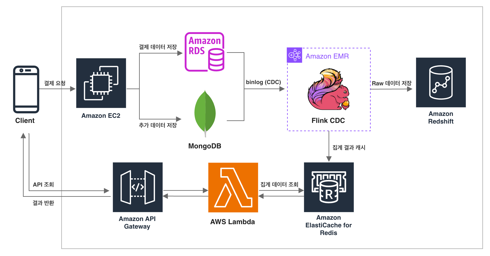

## 과제2. 데이터 파이프라인 아키텍처   

### 아키텍처 구성도
---

1. **Client → Amazon EC2**:
   - 클라이언트 요청에 따라 EC2에서 데이터가 처리되며, 처리 결과는 RDS와 MongoDB에 저장
   - 결제 데이터는 트랜잭션이 중요하므로 RDB(Amazon RDS)에 저장, MongoDB는 추가적인 메타데이터, JSON 로그, 주문 상세 데이터 등을 저장

2. **Amazon RDS, MongoDB → Flink CDC (on Amazon EMR)**:
   - RDS의 binlog와 MongoDB 변경 데이터를 기반으로 Flink CDC 커넥터를 사용하여 실시간으로 **Change Data Capture (CDC)** 수행
   - Flink CDC는 **Amazon EMR 위에서 실행되며**, RDS로부터 변경 데이터를 실시간으로 수집

3. **Flink CDC 처리 결과 → Redshift & Redis**:
   - 데이터를 수집하여 추후 분석 목적으로 Redshift에 Raw 데이터 적재
   - Sliding Window (30분 창, 1분 슬라이딩) 방식으로 집계한 상점별 결제 금액 및 수량 데이터를 Redis에 캐싱

4. **Client → API Gateway → Lambda → Redis**:
   - 클라이언트가 API Gateway를 통해 데이터를 요청하면, Lambda 함수가 Redis에서 집계 데이터를 조회

5. **Lambda → API Gateway → Client**
    - 조회된 결과를 API Gateway를 통해 클라이언트에게 반환
  
 
     
### 기술 선정 이유
---
1. Flink CDC (on Amazon EMR)
    - 서비스에 미치는 영향 최소화: Flink CDC는 binlog 기반으로 데이터 변경 사항을 실시간으로 감지하여 **Change Data Capture (CDC)**를 수행합니다. 이를 통해 실 서비스에 미치는 영향을 최소화하면서 데이터 변경을 효율적으로 처리할 수 있습니다. 또한, Flink는 상태 관리와 타임 윈도우 집계를 지원하여 복잡한 실시간 데이터 처리 및 집계 작업을 손쉽게 구현할 수 있습니다.
    - 간단한 구성: Flink는 Kafka 없이도 가벼운 구성이 가능하여, 복잡한 인프라를 최소화할 수 있습니다.
    - EMR 기반의 확장성: Kinesis Data Analytics와 같은 관리형 서비스는 CDC 커넥터를 사용하려면 별도의 빌드 및 업로드 작업이 필요하며, 연동에 제한이 있습니다. 반면, Amazon EMR은 클러스터 기반으로 유연하게 구축할 수 있어, 데이터 파이프라인을 손쉽게 확장하고 관리할 수 있습니다.
2. Amazon ElastiCache for Redis
    - 자동 관리형 서비스: ElastiCache for Redis는 AWS에서 제공하는 관리형 서비스로, 운영 부담을 크게 줄여줍니다. 클러스터 관리, 장애 복구, 모니터링, 백업 등이 자동으로 처리됩니다.
    - 빠른 속도와 다양한 데이터 구조 지원: Redis는 메모리 기반 저장소로 매우 빠른 데이터 액세스를 제공합니다. 또한, RedisTimeSeries와 같은 모듈을 통해 시간 시리즈 데이터 처리에도 최적화되어 있습니다.
    - TTL 및 시간 기반 데이터 처리: TTL(Time-to-Live) 기능을 통해 시간 기반 캐시 관리가 가능하며, 데이터의 자동 만료 처리와 효율적인 리소스 관리를 지원합니다.
3. Lambda + API Gateway
    - 가벼운 구성과 간편한 관리: 현재 요구사항이 최근 30분 동안의 집계 데이터 조회로, 간단한 데이터 처리에 Lambda와 API Gateway를 사용이 적합하다고 생각하였습니다. 별도의 API 서버 없이 간단하고 효율적인 서버리스 아키텍처로 복잡한 관리 없이 사용할 수 있습니다. 
    - 추후 확장: 처음 구축 시 간단하게 구현하고 데이터 조회량이 많아지거나 더 복잡한 API 요구 사항이 생길 경우, EC2 백엔드 서버로 변경하여 사용하는 것이 좋을 것 같다고 생각했습니다.
4. Amazon Redshift
    - 일회성 집계에 그치는 것이 아니라, CDC를 통해 수집한 데이터를 향후 분석을 위한 데이터 웨어하우스에 적재하는 것이 중요하다고 생각하여 Amazon Redshift를 추가하였습니다. AWS 기반의 컬럼 기반 데이터 저장소로서, 복잡한 분석 쿼리와 집계 작업에서 뛰어난 성능을 제공하여서 선정하였습니다. 